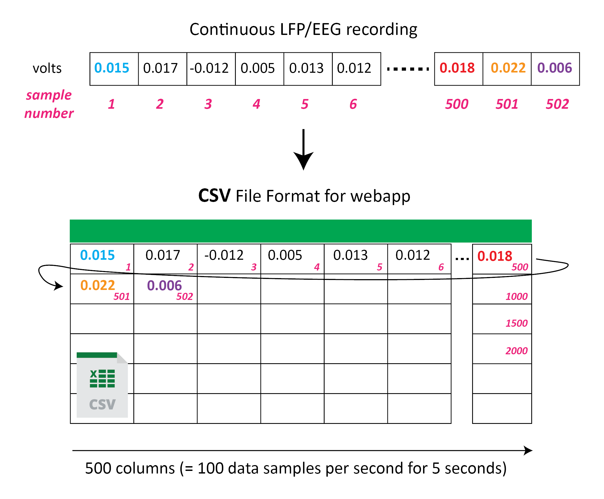

# :page_facing_up: edf-convert
Conversion of **edf** files to **csv** or **h5** format.

---
## How it works
An **edf** file is converted to 2D **csv** files (one per channel) or one 3D **h5** file.

For **csv** : 

    rows = nSamples/columns
    columns = win * new_fs
    
**Example:**

        
For **h5**:

    1st-dimension, X = nSamples/Y
    2nd-dimension, Y = win * new_fs
    3rd-dimension, Z = number of channels
    
- Where *'nSamples'* is the number of samples in one channel of the **edf** file.

- The signals are also scaled according to the *'scale'* factor.

- For *'scale'*, *'win'* and *'new_fs'* check the [configuration settings](#configuration-settings).
        
---
## How to use
Simply execute:
    python edf_convert.py
    
and follow script instructions after execute 

---
### :snake: Dependencies

- [numpy](https://numpy.org/)
- [scipy](https://www.scipy.org/)
- [pytables](https://www.pytables.org/)
- [pyedflib](https://pyedflib.readthedocs.io/en/latest/)
- [tqdm](https://github.com/tqdm/tqdm)

---
## Configuration settings

    - win : window size in seconds, Default = 5
    - fs : sampling rate (samples per second), Default = 2000
    - new_fs : sampling rate after decimation (samples per second), Default = 100
    - scale : signal scaling factor, Default = 1

